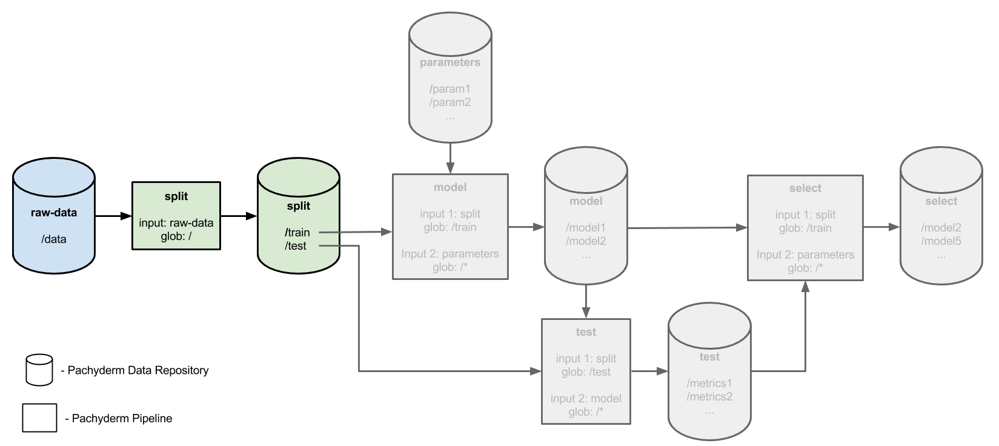
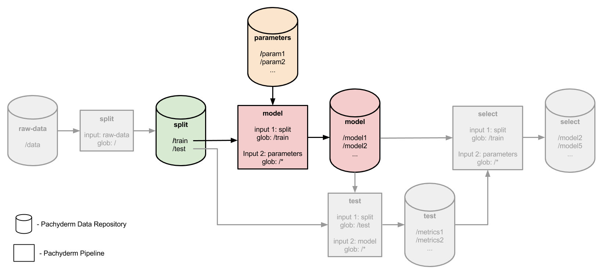
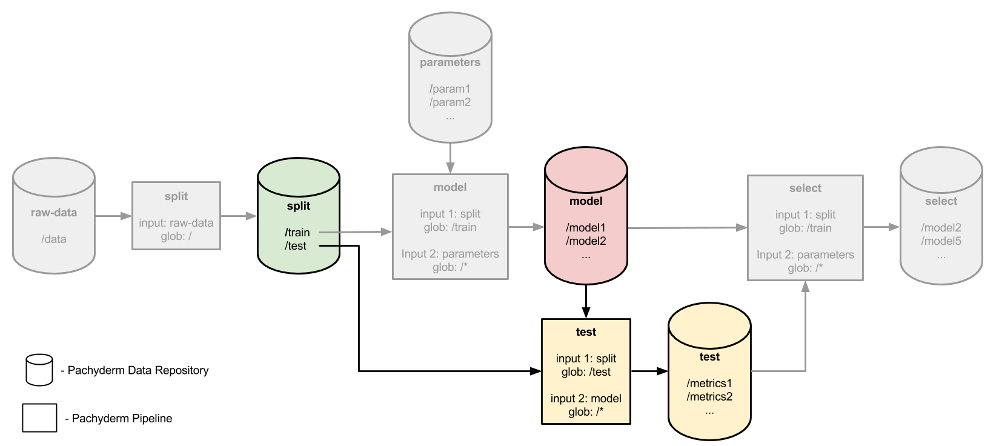
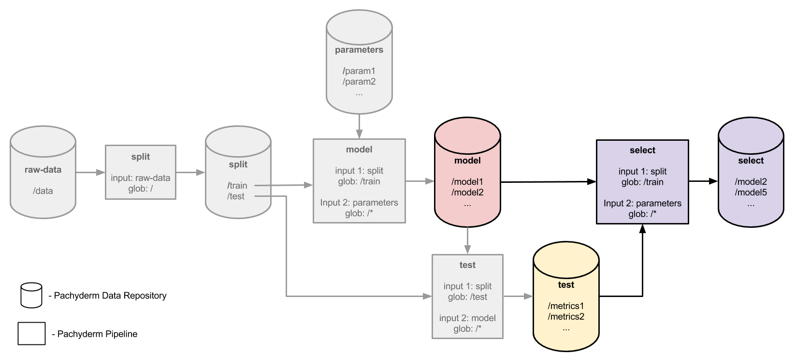

# KubeCon Asia 2018 - Building A Modern Data Science Pipeline

This is an example of setting up an end to end data science pipeline to create a fast and reliable process for going from a user problem to an customer impacting solution.

This example will walkthrough setting up a continous integration pipeline using [Azure DevOps](https://azure.microsoft.com/en-us/services/devops). The pipeline is triggered when a PR on Github is merged into master. The pipeline will:

1. Build the image that trains the model

2. Push the image to an Azure Container Registry (You can use any registry e.g. [DockerHub](http://dockerhub.com))

3. Add the newly build image tag into the pipeline specifications

4. Deploy the new pipeline and reprocess the data

The main data science pipeline comes from the [Pachyderm Hyperparameter Tuning Example](https://github.com/pachyderm/pachyderm/tree/master/doc/examples/ml/hyperparameter).

The example pipeline we will be using will show evalutating different parameters and selecting the best models. The pipeline takes in raw data, in this case the iris dataset. It will split that data into training and testing. Then generated models based on different parameters. The models are then evaluated and the top models are selected based on an error threshhold.

## Prerequisites

- A Pachyderm cluster running - see [this guide](https://docs.microsoft.com/en-us/azure/aks/kubernetes-walkthrough) on creating a Azure Managed Kuberentes Cluster and [install pachyderm](http://docs.pachyderm.io/en/latest/deployment/azure.html).
- The `pachctl` CLI tool installed and connected to your Pachyderm cluster - see the[deploy docs](http://pachyderm.readthedocs.io/en/latest/deployment/deploy_intro.html) for instructions.

## The Pipelines

The example uses 4 pipeline stages to accomplish this distributed hyperparameter tuning/search. First we will split our iris data set into a training and test data set. The training set will be used to train or fit our model with the various sets of parameters and the test set will be used later to evaluate each trained model.



Next, we will train a model for each combination of _C_ and _Gamma_ parameters in a `parameters` repo. The trained models will be serialized and output to the `model` repo.



In a `test` stage we will pair each trained/fit model in `model` with our test data set. Using the test data set we will generate an evaluation metric, or score, for each of the train models.



Finally, in a `select` stage we will determine which of the evaluate metrics in `test` is the best, select out the models corresponding to those metrics, and output them to the `select` repo.



## Create the Pipeline

Make sure pachctl is connected to your cluster and run the following command to set up the entire pipeline

    cd scrips
    ./setup.sh

_Note:_ You may need to run `chmod a+x setup.sh` to make it executable.

The script will create:

1. Create the raw_data and parameters data repositories

2. Add the base data to the repositories. We will be adding the iris dataset with a little noise as a csv to the repository. For the parameters, we use Pachyderms built in splitting capability to convert each line of our parameter file into a seperate file. This will make it easier to distribute them between multiple instances of the running contianer.

3. Create the pipelines from the pipeline files.

Run the following command to view the parameters added to the repository.

```sh
$ pachctl list-file parameters master c_parameters.txt
NAME                                TYPE                SIZE
c_parameters.txt/0000000000000000   file                6B
c_parameters.txt/0000000000000001   file                6B
c_parameters.txt/0000000000000002   file                6B
c_parameters.txt/0000000000000003   file                6B
c_parameters.txt/0000000000000004   file                6B
c_parameters.txt/0000000000000005   file                7B
c_parameters.txt/0000000000000006   file                8B
c_parameters.txt/0000000000000007   file                8B
c_parameters.txt/0000000000000008   file                9B
c_parameters.txt/0000000000000009   file                9B
c_parameters.txt/000000000000000a   file                10B
```

You can see each individule file with:

    $ pachctl get-file parameters master c_parameters.txt/0000000000000000
    0.031

For more information on splitting data files, see our [splitting data for distributed processing](http://pachyderm.readthedocs.io/en/latest/cookbook/splitting.html) cookbook recipe.

Next we can see the pipeline pods coming up in Kubeneretes

```sh
$ kubectl get pods
NAME                       READY     STATUS    RESTARTS   AGE
etcd-2142892294-nzb39      1/1       Running   0          1h
pachd-776177201-ww198      1/1       Running   0          1h
pipeline-model-v1-htphr    2/2       Running   0          7m
pipeline-select-v1-240bt   2/2       Running   0          7m
pipeline-split-v1-9lwkn    2/2       Running   0          7m
pipeline-test-v1-h47lw     2/2       Running   0          7m
```

And, after waiting a few minutes, you should see the successful jobs that did our distributed hyperparameter tuning:

```sh
$ pachctl list-job
ID                                   OUTPUT COMMIT                           STARTED            DURATION           RESTART PROGRESS    DL       UL       STATE
e2b75a61-13e2-4067-88b7-adec4d32f830 select/f38eae7cea574fc6a90adda706d4714e 18 seconds ago     Less than a second 0       1 + 0 / 1   243.2KiB 82.3KiB  success
4116af2b-efa5-405e-ba04-f850a656e25d test/1e379911118c4492932a2dd9eb198e9a   About a minute ago About a minute     0       77 + 0 / 77 400.3KiB 924B     success
f628028e-2c88-439e-8738-823fe0441e1b model/6a877b93e3e2445e92a11af8bde6dddf  3 minutes ago      About a minute     0       77 + 0 / 77 635.1KiB 242.3KiB success
a2ba2024-db12-4a78-9383-82adba5a4c3d split/04955ad7fda64a66820db5578478c1d6  5 minutes ago      Less than a second 0       1 + 0 / 1   10.29KiB 10.29KiB success
```

## Looking at the results

If we look at the models that were trained based on our training data, we will see one model for each of the combinations of _C_ and _Gamma_ parameters:

```sh
$ pachctl list-file model master
NAME                        TYPE                SIZE
model_C0.031_G0.001.pkl     file                6.908KiB
model_C0.031_G0.004.pkl     file                6.908KiB
model_C0.031_G0.016.pkl     file                6.908KiB
model_C0.031_G0.063.pkl     file                6.908KiB
model_C0.031_G0.25.pkl      file                6.908KiB
model_C0.031_G1.0.pkl       file                6.908KiB
model_C0.031_G4.0.pkl       file                6.908KiB
model_C0.125_G0.001.pkl     file                4.85KiB
model_C0.125_G0.004.pkl     file                4.85KiB
model_C0.125_G0.016.pkl     file                4.85KiB
model_C0.125_G0.063.pkl     file                4.85KiB
model_C0.125_G0.25.pkl      file                4.85KiB
model_C0.125_G1.0.pkl       file                4.85KiB
etc...
```

There should be 77 of these models:

```sh
$ pachctl list-file model master | wc -l
78
```

But not all of these models are ideal for making our predictions. Our `select` pipeline stage automatically selected out the best of these models (based on the evaluation metrics generated by the `test` stage). We can see which of the models are ideal for our predictions as follows:

```sh
$ pachctl list-file select master | wc -l
36
$ pachctl list-file select master
NAME                      TYPE                SIZE
model_C0.031_G0.001.pkl   file                5.713KiB
model_C0.031_G0.004.pkl   file                5.713KiB
model_C0.031_G0.016.pkl   file                5.713KiB
model_C0.031_G0.063.pkl   file                5.713KiB
model_C0.031_G0.25.pkl    file                5.713KiB
model_C0.031_G1.0.pkl     file                5.713KiB
model_C0.031_G4.0.pkl     file                5.713KiB
etc...
```

_Note_ - Here, 36 of the 77 models were selected as ideal. Due to the fact that we are randomly shuffling our training/test data, your results may vary slightly.

_Note_ - The pipeline we've built here is very easy to generalize for any sort of parameter space exploration. As long as you break up your parameters into individual files (as shown above), you can test the whole parameter space in a massively distributed way and simply pick out the best results.

## Setting Up Continuous Integratino with Azure DevOps
